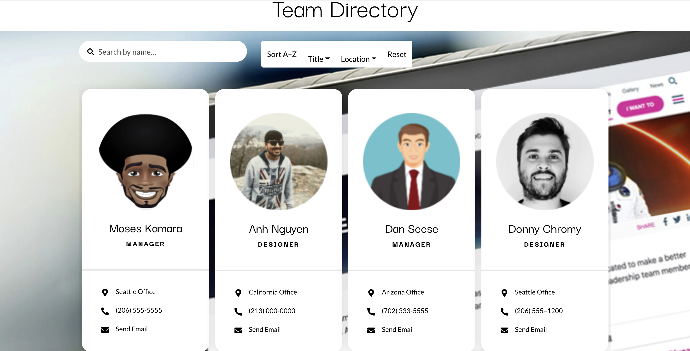

## Badges

## Description:
This application allows a user to track funds in a budget by entering transactions. It uses progressive web application technology to provide functionality while offline - transactions are able to be entered and saved and post to the database when the app returns to an online state.

## Technologies:
- Bootstrap
- Node.js
- React
- React-Dom
- React-Icons
- React-Router-Dom
- React-Bootstrap
- React-Motion
- React-Scripts
- React-Lazyload
- Service Worker
- Manifest
- JSON
- Web Vitals

## Table of Contents
* [Description](#description)
* [Technologies](#topics)
* [Installation](#installation)
* [Usage](#usage)
* [Contributing](#contributing)
* [Test](#test)
* [Challenges](#challenges)
* [Questions](#questions)
* [License](#license)
* [Author](#Author)
* [Badges](#badges)

## Installation
Before installing this application on your local computer, ensure that you have Node installed. This application works in Node. You can go to the following website to download Node: <a href='https://nodejs.org/en/'>Node</a>

This is a react act application.

    1. Clone the Git repository
        $ git clone <repo>
    2. Navigate to the directory and install the dependencies
        
    3.  To run it locally, type npm run start

## Usage
Once all dependencies have been installed in your local directory. Type npm run start in your terminal to launch the react application in your browser.

## Contributors
This application is open to anyone who wants to contribute or enhance the application. If you would like to contribute please reach out to me on Github or email.

## Test
Launches the test runner in the interactive watch mode.\
See the section about [running tests](https://facebook.github.io/create-react-app/docs/running-tests) for more information.

## Challenges
This was the first official react application I have created. That came with its challenges due to not having much experience with react and doing a lot of research to figure some of the components and workings out.

## Questions
If you have questions about this repository? Please contact me at [kamara.moses@yahoo.com](mailto:kamara.moses@yahoo.com). View more of my work in GitHub at [kamara-moses](https://github.com/kamara-moses).

## License
This repository is licensed under the MIT license.

Copyright (c) [2020] [Moses Kamara]

Permission is hereby granted, free of charge, to any person obtaining a copy of this software and associated documentation files (the 'Software'), to deal in the Software without restriction, including without limitation the rights to use, copy, modify, merge, publish, distribute, sublicense, and/or sell copies of the Software, and to permit persons to whom the Software is furnished to do so, subject to the following conditions:

The above copyright notice and this permission notice shall be included in all copies or substantial portions of the Software.

THE SOFTWARE IS PROVIDED 'AS IS', WITHOUT WARRANTY OF ANY KIND, EXPRESS OR IMPLIED, INCLUDING BUT NOT LIMITED TO THE WARRANTIES OF MERCHANTABILITY, FITNESS FOR A PARTICULAR PURPOSE AND NONINFRINGEMENT. IN NO EVENT SHALL THE AUTHORS OR COPYRIGHT HOLDERS BE LIABLE FOR ANY CLAIM, DAMAGES OR OTHER LIABILITY, WHETHER IN AN ACTION OF CONTRACT, TORT OR OTHERWISE, ARISING FROM, OUT OF OR IN CONNECTION WITH THE SOFTWARE OR THE USE OR OTHER DEALINGS IN THE SOFTWARE.

## Author 

# Getting Started with Create React App

This project was bootstrapped with [Create React App](https://github.com/facebook/create-react-app).

## Available Scripts

In the project directory, you can run:

### `npm start`

Runs the app in the development mode.\
Open [http://localhost:3000](http://localhost:3000) to view it in the browser.

The page will reload if you make edits.\
You will also see any lint errors in the console.

### `npm test`

Launches the test runner in the interactive watch mode.\
See the section about [running tests](https://facebook.github.io/create-react-app/docs/running-tests) for more information.

### `npm run build`

Builds the app for production to the `build` folder.\
It correctly bundles React in production mode and optimizes the build for the best performance.

The build is minified and the filenames include the hashes.\
Your app is ready to be deployed!

See the section about [deployment](https://facebook.github.io/create-react-app/docs/deployment) for more information.

### `npm run eject`

**Note: this is a one-way operation. Once you `eject`, you can’t go back!**

If you aren’t satisfied with the build tool and configuration choices, you can `eject` at any time. This command will remove the single build dependency from your project.

Instead, it will copy all the configuration files and the transitive dependencies (webpack, Babel, ESLint, etc) right into your project so you have full control over them. All of the commands except `eject` will still work, but they will point to the copied scripts so you can tweak them. At this point you’re on your own.

You don’t have to ever use `eject`. The curated feature set is suitable for small and middle deployments, and you shouldn’t feel obligated to use this feature. However we understand that this tool wouldn’t be useful if you couldn’t customize it when you are ready for it.

## Learn More

You can learn more in the [Create React App documentation](https://facebook.github.io/create-react-app/docs/getting-started).

To learn React, check out the [React documentation](https://reactjs.org/).

### Code Splitting

This section has moved here: [https://facebook.github.io/create-react-app/docs/code-splitting](https://facebook.github.io/create-react-app/docs/code-splitting)

### Analyzing the Bundle Size

This section has moved here: [https://facebook.github.io/create-react-app/docs/analyzing-the-bundle-size](https://facebook.github.io/create-react-app/docs/analyzing-the-bundle-size)

### Making a Progressive Web App

This section has moved here: [https://facebook.github.io/create-react-app/docs/making-a-progressive-web-app](https://facebook.github.io/create-react-app/docs/making-a-progressive-web-app)

### Advanced Configuration

This section has moved here: [https://facebook.github.io/create-react-app/docs/advanced-configuration](https://facebook.github.io/create-react-app/docs/advanced-configuration)

### Deployment

This section has moved here: [https://facebook.github.io/create-react-app/docs/deployment](https://facebook.github.io/create-react-app/docs/deployment)

### `npm run build` fails to minify

This section has moved here: [https://facebook.github.io/create-react-app/docs/troubleshooting#npm-run-build-fails-to-minify](https://facebook.github.io/create-react-app/docs/troubleshooting#npm-run-build-fails-to-minify)
